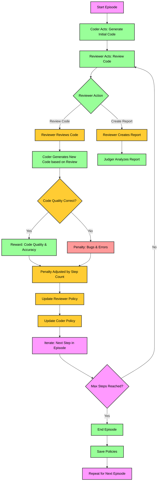

# **Relatório sobre o Sistema de Aprendizado por Reforço Colaborativo**

## **Introdução**

Neste projeto, desenvolvemos um ambiente de aprendizado por reforço colaborativo envolvendo três agentes principais: um **codificador** (*coder*), um **revisor** (*reviewer*) e um **julgador** (*judger*). O objetivo desse sistema é melhorar iterativamente a qualidade do código e relatórios gerados pelos agentes, utilizando feedback contínuo e aprendizado baseado em recompensas.

Nossa ideia é de que queremos aprender a sequência de movimentos que maximize o retorno, num espaço pré-definido de ações. Ou seja, dados um sub-espaço de 4 ações para o coder e outro para o reviewer, queremos que o sistema aprenda o jeito mais rápido de tornar o código e o relatório adequados.

A política dos agentes é atualizada utilizando uma abordagem epsilon-greedy com aproximação por redes neurais, a qual permite aprender a melhor estratégia para cada estado. O sistema também controla os episódios e passos no ambiente, garantindo avaliações consistentes.

## **Intruções para execução**

Primeiramente, é necessário conferir os valores das duas variáveis de ambiente necessárias:

- `GROQ_API_KEY`: chave para ter acesso à API do Chat Groq. Ela já estará definida no arquivo `.env`.
- `SCRIPTS_PATH`: caminho para as bibliotecas de análise estática **ruff**, **mypy** e **bandit**. Provavelmente uma string vazia nessa variável funcionará, mas, caso ocorra algum problema de path relacionado a essas bibliotecas, pode ser necessário personalizá-la.

Após isso, basta executar o arquivo `main.py`.

## **Interação entre os Componentes**

O sistema é dividido em três componentes principais que interagem da seguinte forma:

### **1. Codificador (Coder)**
- **Função:** Gera novos códigos com base em seu estado atual e suas ações.
- **Entrada:** Feedback do revisor, representado pelas notas atribuídas.
- **Saída:** Código gerado que será analisado pelo revisor.
- **Atualização:** Sua política é ajustada com base na recompensa (soma das notas do revisor).

### **2. Revisor (Reviewer)**
- **Função:** Analisa o código gerado pelo codificador e decide entre revisar o código ou criar relatórios.
- **Entrada:** Código do codificador e notas sobre o relatório fornecidas pelo julgador.
- **Saída:** Relatório avaliado pelo julgador ou ações de revisão que influenciam o codificador.
- **Atualização:** A política é ajustada com base nas notas atribuídas pelo julgador ou na evolução do código.

### **3. Julgador (Judger)**
- **Função:** Avalia os relatórios gerados pelo revisor e atribui recompensas (notas).
- **Entrada:** Relatório do revisor.
- **Saída:** Notas que representam a qualidade do relatório.
- **Impacto:** Suas avaliações influenciam diretamente as políticas do revisor e, indiretamente, do codificador.

### **Fluxo do Sistema**
1. O **codificador** gera um código inicial e passa para o **revisor**.
2. O **revisor** decide entre revisar o código ou criar um relatório com base em sua política.
3. Caso um relatório seja criado, o **julgador** avalia e atribui notas.
4. Ambos o **codificador** e o **revisor** ajustam suas políticas com base nas recompensas recebidas.
5. O processo se repete até que a nota do report seja alta o suficiente ou que o sistema atinja o número máximo de passos.

## **Política Epsilon-Greedy com Aproximação por Redes Neurais**

A política é implementada na classe `EpsilonGreedyPolicyApprox` e utiliza uma rede neural para estimar os valores $Q(s, a)$. A escolha das ações é baseada em uma estratégia epsilon-greedy, que equilibra exploit e explore.

### **Estrutura da Rede Neural**
- Camada de entrada: Número de dimensões do estado (`state_dim`).
- Duas camadas ocultas com 64 neurônios cada e ativação ReLU.
- Camada de saída: Número de ações possíveis (`n_actions`).

### **Seleção de Ação**
A função `get_action` escolhe ações com base nos seguintes critérios:
1. **Exploração:** Com probabilidade $\epsilon$, seleciona uma ação aleatória.
2. **Exploitação:** Com probabilidade $1-\epsilon$, seleciona a ação com maior valor $Q(s, a)$.

### **Atualização dos Pesos**
A política é ajustada utilizando o algoritmo de *backpropagation*:
1. Calcula o valor alvo:
   $$
   Q_{\text{target}} = \text{reward} + \gamma \cdot \max_a Q(\text{next\_state}, a)
   $$
2. Calcula a perda entre o valor estimado e o alvo.
3. Atualiza os pesos da rede utilizando o otimizador Adam.

### **Exploração Decrescente**
O valor de $\epsilon$ diminui ao longo do tempo, conforme o modelo aprende:
$$
\epsilon = \max(\epsilon_{\text{min}}, \epsilon \cdot \epsilon_{\text{decay}})
$$

## **Funcionamento do Ambiente**

O ambiente é gerenciado pela classe `Environment`, que controla os episódios e a interação entre os agentes. 

### **Ciclo de um Episódio**
1. O **codificador** gera o código inicial.
2. O **revisor** analisa o código e decide:
   - Revisar o código, gerando uma nova versão.
   - Criar um relatório para avaliação pelo julgador.
3. O **julgador** avalia o relatório e atribui recompensas.
4. As políticas dos agentes são atualizadas com base nos estados e recompensas.
5. O episódio termina quando:
   - O limite de passos é atingido.
   - A soma das recompensas excede o limiar definido.

### **Controle de Episódios**
- Cada episódio tem um limite de 50 passos.
- O ambiente armazena os resultados de cada episódio em um arquivo CSV para posterior análise.

## **Fluxograma do modelo**

## **Desafios Enfrentados**

Durante o desenvolvimento do sistema, enfrentamos vários desafios técnicos e de implementação. Abaixo estão os principais:

### **Uso do LLM Groq**
Escolhemos o Groq como modelo de linguagem devido ao seu fácil acesso e simplicidade de uso. No entanto, ele apresenta uma limitação significativa: **não salva mensagens por padrão**. Isso implica que, a cada iteração, é necessário fornecer novamente todo o contexto do problema, aumentando o consumo de espaço e dificultando a escalabilidade do sistema. Esse problema se torna ainda mais relevante em tarefas onde o contexto evolui dinamicamente.

### **Tentativa de Uso de Instructor**
Inicialmente, tentamos utilizar o LLM **Instructor** como alternativa. Ele oferece maior flexibilidade para a criação de código e relatórios com respostas estruturadas. Contudo, enfrentamos problemas consistentes com erros na geração de código, impossibilitando seu uso. 

Esse comportamento foi identificado como um problema recorrente em discussões na comunidade do **LangChain**, como evidenciado [neste tópico](https://github.com/langchain-ai/langchain/discussions/24309), onde outros desenvolvedores relatam a mesma dificuldade.

> *"Ao tentar usar o Instructor para geração de código, o processo sempre resultava em erros fatais que inviabilizavam o fluxo de trabalho."*

Apesar dessas limitações, decidimos seguir com o Groq devido à sua confiabilidade em outras tarefas e pela inexistência de soluções estáveis para os problemas do Instructor no momento. Contudo, esses desafios destacam a importância de otimizações futuras no gerenciamento de contexto e exploração de novas ferramentas que possam mitigar essas dificuldades.