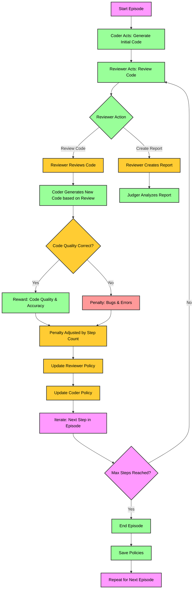

```mermaid
graph TD
    A[Start Episode] --> B[Coder Acts: Generate Initial Code]
    B --> C[Reviewer Acts: Review Code]
    C --> D{Reviewer Action}
    D -- Review Code --> E[Reviewer Reviews Code]
    D -- Create Report --> F[Reviewer Creates Report]
    E --> G[Coder Generates New Code based on Review]
    F --> H[Judger Analyzes Report]
    G --> I{Code Quality Correct?}
    I -- Yes --> J[Reward: Code Quality & Accuracy]
    I -- No --> K[Penalty: Bugs & Errors]
    J --> L[Reward Adjusted by Step Count]
    K --> L[Penalty Adjusted by Step Count]
    L --> M[Update Reviewer Policy]
    M --> N[Update Coder Policy]
    N --> O[Iterate: Next Step in Episode]
    O --> P{Max Steps Reached?}
    P -- No --> C
    P -- Yes --> Q[End Episode]
    Q --> R[Save Policies]
    R --> S[Repeat for Next Episode]
    
    style A fill:#f9f,stroke:#333,stroke-width:2px,color:#000;
    style B fill:#9f9,stroke:#333,stroke-width:2px,color:#000;
    style C fill:#9f9,stroke:#333,stroke-width:2px,color:#000;
    style D fill:#9f9,stroke:#333,stroke-width:2px,color:#000;
    style E fill:#fc3,stroke:#333,stroke-width:2px,color:#000;
    style F fill:#fc3,stroke:#333,stroke-width:2px,color:#000;
    style G fill:#9f9,stroke:#333,stroke-width:2px,color:#000;
    style H fill:#9f9,stroke:#333,stroke-width:2px,color:#000;
    style I fill:#fc3,stroke:#333,stroke-width:2px,color:#000;
    style J fill:#9f9,stroke:#333,stroke-width:2px,color:#000;
    style K fill:#f99,stroke:#333,stroke-width:2px,color:#000;
    style L fill:#fc3,stroke:#333,stroke-width:2px,color:#000;
    style M fill:#fc3,stroke:#333,stroke-width:2px,color:#000;
    style N fill:#fc3,stroke:#333,stroke-width:2px,color:#000;
    style O fill:#f9f,stroke:#333,stroke-width:2px,color:#000;
    style P fill:#f9f,stroke:#333,stroke-width:2px,color:#000;
    style Q fill:#9f9,stroke:#333,stroke-width:2px,color:#000;
    style R fill:#9f9,stroke:#333,stroke-width:2px,color:#000;
    style S fill:#f9f,stroke:#333,stroke-width:2px,color:#000;
```